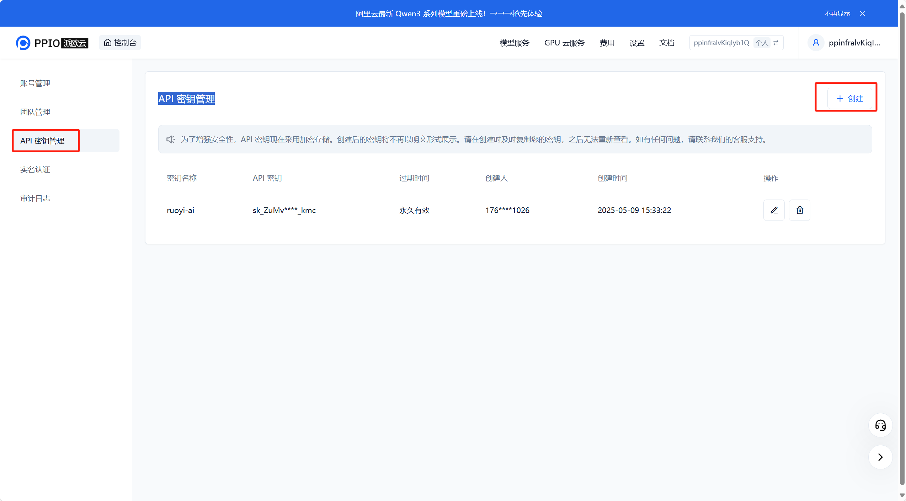
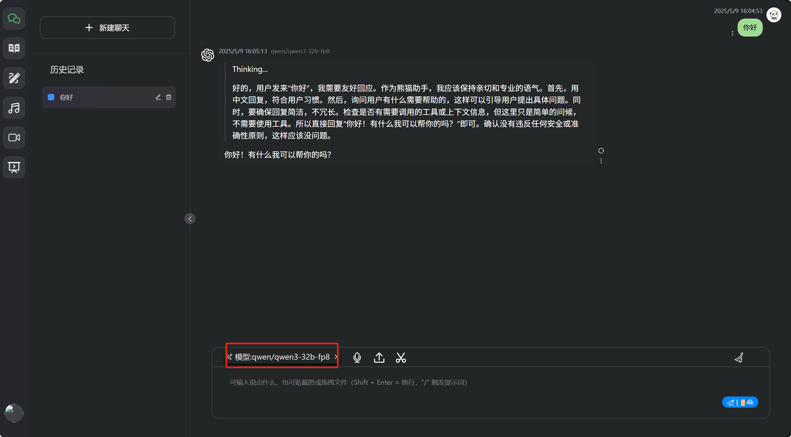

# 关于 RuoYi AI

::: info 你正在阅读的是 [RuoYi AI](https://gitee.com/ageerle/ruoyi-ai)的文档！

- 如发现文档有误，欢迎提交 [issue](https://gitee.com/ageerle/ruoyi-ai/issues) 帮助我们改进。


:::

## 接入PPIO派欧云
1. 访问PPIO派欧云官网
```
https://ppio.cn/user/register?from=ppinfra&invited_by=P8QTUY&utm_source=github_ruoyi-ai

```
2. 登录后点击右上角控制台,控制台页面右上角点击《账号管理》,然后左侧菜单栏切换到《API 密钥管理》创建密钥

- 使用邀请码**P8QTUY**获取更多免费额度
- 注册后会赠送5元免费额度,普通用户并发限制是10次/分钟,如果并发较大可以联系客服升级。

3.配置模型信息
- 模型广场选择一个模型

- 后台模型管理配置(注意结尾没有/)

4. 效果展示


## 接入百搭API
1. 申请API KEY
```
 https://api.pandarobot.chat
```
2. 注册账号后点击添加令牌,参数**全部默认**,然后点击复制按钮可以获取API KEY


3. 运营管理-系统模型-新增模型,在请求密钥处填写上一步申请到的key信息


## 接入扣子API
1. 访问扣子官网创建一个智能体

2. 创建完成后,先复制botId,然后点击发布

3. 只用勾选API,然后点击发布

4. 创建个人访问令牌

5. 后台模型管理配置

6. 效果展示

## 接入difyAPI
1. 登录dify官网，创建一个应用

2. 检查模型设置,配置自己的密钥信息


3. 发布完成后,点击访问API 

4.创建密钥

5. 后台管理配置

6. 效果演示
